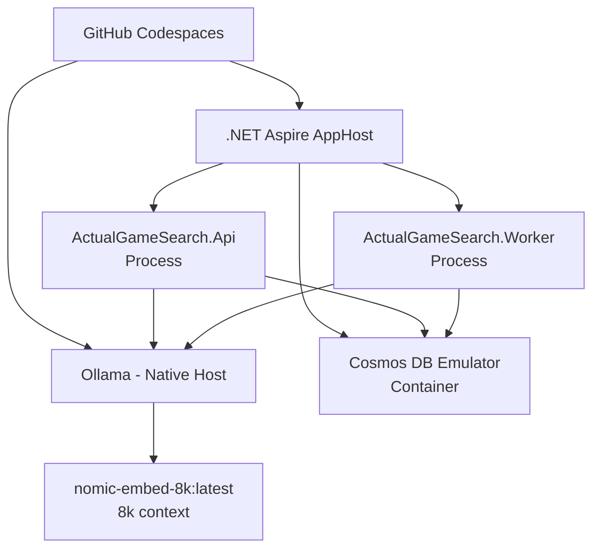

# ActualGameSearch - Deployment Repeatability 

## Quick Start (New Environment)

For any new GitHub Codespace, local dev setup, or deployment:

1. **Clone the repo**
2. **Run the setup script:**
   ```bash
   ./infrastructure/setup-ollama-models.sh
   ```
3. **Start the application:**
   ```bash
   dotnet run --project src/ActualGameSearch.AppHost
   ```

That's it! The custom 8k context model will be created automatically.

## Current Architecture (Simple & Working)



## Why This Approach Works

- **No Docker complexity** - Ollama runs natively, Aspire manages what it needs
- **One setup script** - Handles the 8k context fix automatically  
- **Leverages existing tools** - Uses Aspire's orchestration, not custom Docker compose
- **Fast iteration** - F5 debugging works perfectly
- **Cost effective** - Uses emulators and free tiers

## The 8k Context Fix

**Problem**: `nomic-embed-text:v1.5` hardcoded to 2k tokens  
**Solution**: Custom model with simple Modelfile override  
**Result**: Can process long game descriptions and reviews without truncation

## Integration Points

- **appsettings.json**: Uses `nomic-embed-8k:latest` as model name
- **Worker**: Automatically picks up the custom model
- **Tests**: Pass with the extended context
- **Production**: Same setup script works everywhere